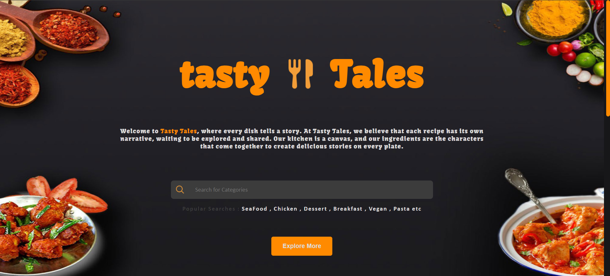

# tastyTales-Recipe-Website-FEWDCA3
You can visit the weisite here : https://tasty-tales.netlify.app/

# Idea 
The idea for creating this webpage is that make a website where you will get the ingredients of some random meals and search meals according to your need. 

# Working of the website
The webiste fetches data from an api https://www.themealdb.com/api.php and shows the data on website accordingly. From the api, we can fetch random meal, meal according to category, using particular meal id etc. Also the ingredients used for making the meal are fetched from the api and showed on the website. 
Fetch of the data is done through Async Await and Fetch Function in JavaScript. 

# Screenshots of website

